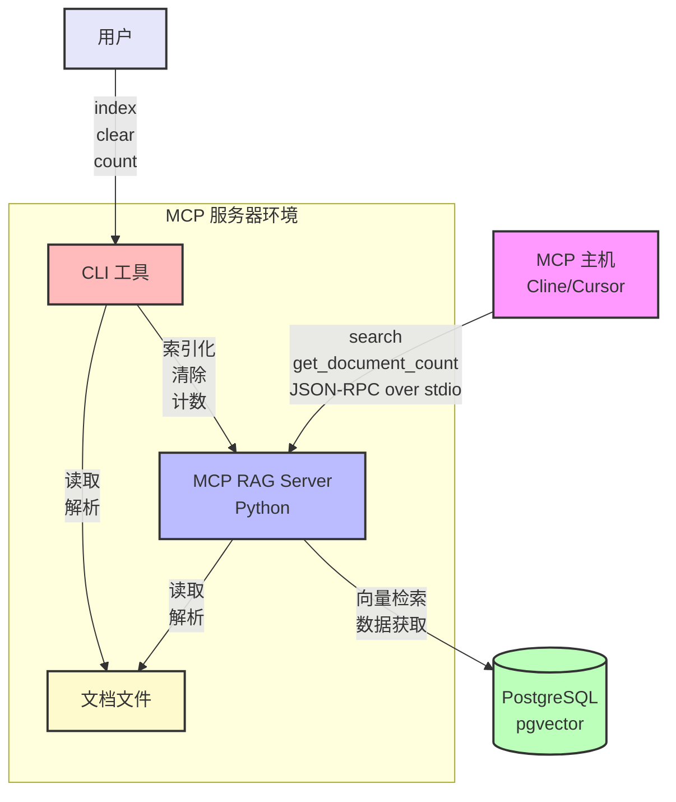
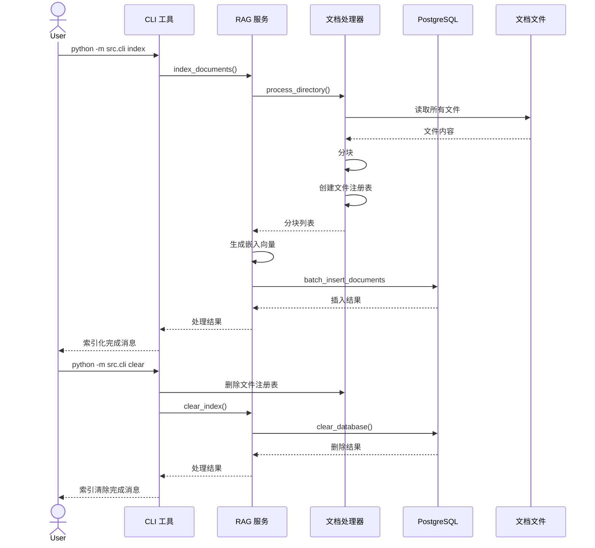
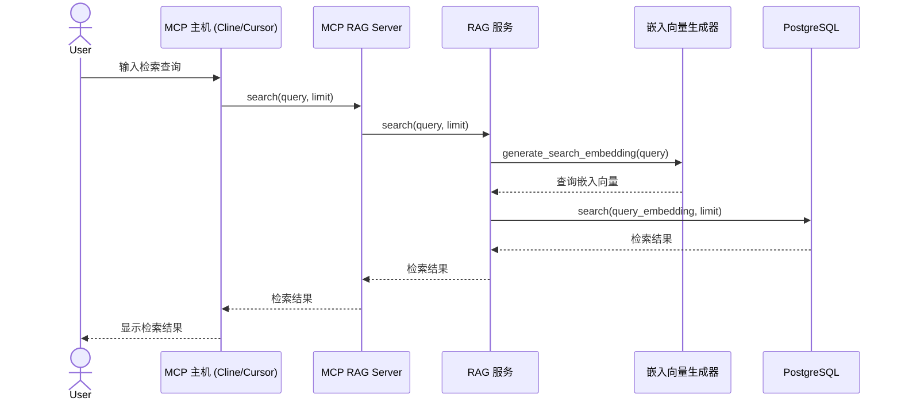

# 需求与设计文档

## 1. 需求定义

### 1.1 基本信息
- 软件名称：MCP RAG Server
- 仓库名称：mcp-rag-server

### 1.2 项目概述

本项目旨在提供一个符合 Model Context Protocol (MCP) 标准的 RAG（Retrieval-Augmented Generation）功能 Python 服务器。它以多种格式的文档（如 Markdown 文件、文本文件、PowerPoint、PDF 等）作为数据源，使用可选的嵌入模型（multilingual-e5-large、ruri 等）进行索引，并提供通过向量检索获取相关信息的功能。

### 1.3 功能需求

#### 1.3.1 MCP 服务器基本实现
- 基于 JSON-RPC over stdio 运行
- 提供工具注册和执行机制
- 错误处理和日志记录

#### 1.3.2 RAG 功能
- 支持多种格式文档（Markdown、文本、PowerPoint、PDF）的读取和解析
- 支持具有层级结构的源目录
- 使用 Markitdown 将 PowerPoint 和 PDF 转换为 Markdown
- 使用可选的嵌入模型（multilingual-e5-large、ruri 等）生成嵌入向量
- 使用 PostgreSQL 的 pgvector 实现向量数据库
- 通过向量检索获取相关信息
- 获取前后分块功能（确保上下文连续性）
- 获取文档全文功能（提供完整上下文）
- 增量索引功能（仅处理新增和变更的文件）

#### 1.3.3 工具
- 向量检索工具（MCP）
- 文档数量获取工具（MCP）
- 索引管理工具（CLI）

### 1.4 非功能需求

- 快速响应
- 注重简洁的架构和可维护性
- 高扩展性设计

### 1.5 约束条件

- 运行于 Python 3.10 以上
- 支持 JSON-RPC over stdio（默认）和 HTTP SSE 两种传输方式
- 需要 PostgreSQL 和 pgvector 扩展

### 1.6 开发环境

- 语言：Python
- 外部库：
  - `mcp[cli]` (Model Context Protocol)
  - `python-dotenv`
  - `psycopg2-binary` (PostgreSQL 连接)
  - `sentence-transformers` (嵌入向量生成)
  - `markdown` (Markdown 解析)
  - `numpy` (向量操作)

### 1.7 交付物

- Python 编写的 MCP 服务器
- RAG 功能实现
- README / 使用说明
- 设计文档

## 2. 系统设计

### 2.1 系统概要设计

#### 2.1.1 系统架构

##### 系统构成图



##### 索引化时序图



##### RAG（检索）时序图



#### 2.1.2 主要组件
- **SDK 服务器（`server.py`）**
  - 基于官方 MCP Python SDK（`mcp.server.lowlevel.Server`）
  - `ToolRegistry`：防止重复注册的工具聚合中心
  - 支持 stdio 和 HTTP SSE 两种传输方式
  - 旧版插件通过 `_adapt_legacy_tools()` 自动桥接
- **旧版 MCP 服务器（`mcp_server.py`，保留兼容）**
  - 手写的 JSON-RPC over stdio 实现
  - 供旧版测试和旧版插件使用，不再作为主传输层
- **文档管理**
  - 读取和解析多种格式的文档
  - 使用 Markitdown 进行格式转换
  - 分块处理
  - 通过文件注册表进行增量管理
- **嵌入向量生成**
  - 支持本地模型（sentence-transformers）和 OpenAI 兼容 API
  - 从文本生成向量表示
- **向量数据库**
  - 使用 PostgreSQL 和 pgvector
  - 向量的保存和检索

### 2.2 详细设计

#### 2.2.1 类设计

##### `ToolRegistry`（`server.py`）
```python
class ToolRegistry:
    def register(tool: mcp_types.Tool, handler: Callable) -> None
    # 同名工具重复注册时立即抛出 ValueError
    def wire(server: LowLevelServer) -> None
    # 在 SDK 服务器上安装唯一的 list_tools / call_tool 处理函数对
```

**关键函数（`server.py`）**:
```python
def create_sdk_server(name, version, description, rag_service, extra_module=None) -> LowLevelServer
# 构建 ToolRegistry → 注册内置工具 → 桥接旧版插件 → 返回 SDK 服务器

async def run_stdio(server: LowLevelServer) -> None
# 以 stdio 传输方式运行

def run_sse(server: LowLevelServer, host: str, port: int) -> None
# 以 HTTP SSE 传输方式运行（调用 uvicorn）

def create_sse_app(server: LowLevelServer) -> Starlette
# 返回 Starlette ASGI 应用（/sse + /messages/ 端点）
```

##### `MCPServer`（`mcp_server.py`，旧版，保留兼容）
```python
class MCPServer:
    def register_tool(name: str, description: str, input_schema: Dict[str, Any], handler: Callable) -> None
    def start(server_name: str, version: str, description: str) -> None
    def _handle_tools_call(params: Dict[str, Any], request_id: Any) -> None
```

##### `DocumentProcessor`
```python
class DocumentProcessor:
    def read_file(file_path: str) -> str
    def convert_to_markdown(file_path: str) -> str
    def split_into_chunks(text: str, chunk_size: int, overlap: int) -> List[str]
    def calculate_file_hash(file_path: str) -> str
    def get_file_metadata(file_path: str) -> Dict[str, Any]
    def load_file_registry(processed_dir: str) -> Dict[str, Dict[str, Any]]
    def save_file_registry(processed_dir: str, registry: Dict[str, Dict[str, Any]]) -> None
    def process_file(file_path: str, processed_dir: str, chunk_size: int, overlap: int) -> List[Dict[str, Any]]
    def process_directory(source_dir: str, processed_dir: str, chunk_size: int, overlap: int, incremental: bool = False) -> List[Dict[str, Any]]
```

##### `EmbeddingGenerator`
```python
class EmbeddingGenerator:
    def __init__(model_name: str)
    def generate_embedding(text: str) -> List[float]
    def generate_embeddings(texts: List[str]) -> List[List[float]]
    def generate_search_embedding(query: str) -> List[float]
```

##### `VectorDatabase`
```python
class VectorDatabase:
    def __init__(connection_params: Dict[str, Any])
    def initialize_database() -> None
    def insert_document(document_id: str, content: str, file_path: str, chunk_index: int, embedding: List[float], metadata: Dict[str, Any]) -> None
    def batch_insert_documents(documents: List[Dict[str, Any]]) -> None
    def search(query_embedding: List[float], limit: int = 5) -> List[Dict[str, Any]]
    def delete_document(document_id: str) -> None
    def delete_by_file_path(file_path: str) -> int
    def clear_database() -> int
    def get_document_count() -> int
    def get_adjacent_chunks(file_path: str, chunk_index: int, context_size: int = 1) -> List[Dict[str, Any]]
    def get_document_by_file_path(file_path: str) -> List[Dict[str, Any]]
```

##### `RAGService`
```python
class RAGService:
    def __init__(document_processor: DocumentProcessor, embedding_generator: EmbeddingGenerator, vector_database: VectorDatabase)
    def index_documents(source_dir: str, processed_dir: str = None, chunk_size: int = 500, chunk_overlap: int = 100, incremental: bool = False) -> Dict[str, Any]
    def search(query: str, limit: int = 5, with_context: bool = False, context_size: int = 1, full_document: bool = False) -> List[Dict[str, Any]]
    def clear_index() -> Dict[str, Any]
    def get_document_count() -> int
```

#### 2.2.2 数据库架构

```sql
-- 文档表
CREATE TABLE documents (
    id SERIAL PRIMARY KEY,
    document_id TEXT UNIQUE NOT NULL,
    content TEXT NOT NULL,
    file_path TEXT NOT NULL,
    chunk_index INTEGER NOT NULL,
    embedding vector(1024),  -- multilingual-e5-large 的维度数
    created_at TIMESTAMP WITH TIME ZONE DEFAULT CURRENT_TIMESTAMP,
    metadata JSONB
);

-- 索引
CREATE INDEX idx_documents_embedding ON documents USING ivfflat (embedding vector_cosine_ops);
```

### 2.3 接口设计

#### 2.3.1 MCP 工具

##### `search`
进行向量检索的工具

- 输入参数：
  - `query`：检索查询
  - `limit`（可选）：返回结果的数量（默认：5）
  - `with_context`（可选）：是否获取前后分块（默认：true）
  - `context_size`（可选）：获取前后分块的数量（默认：1）
  - `full_document`（可选）：是否获取文档全文（默认：false）

- 输出：
  - 检索结果列表（按文件路径和分块索引排序）
    - 文档 ID
    - 内容
    - 文件路径
    - 分块索引
    - 相关度分数
    - 元数据
    - 上下文标志（前后分块时为 True）
    - 全文文档标志（文档全文时为 True）

##### `get_document_count`
获取索引中文档数量的工具

- 输入参数：无

- 输出：
  - 文档数量

#### 2.3.2 CLI 命令

##### `index`
为文档建立索引的命令

- 参数：
  - `--directory`, `-d`：包含要索引文档的目录路径（默认：./data/source）
  - `--chunk-size`, `-s`：分块大小（字符数）（默认：500）
  - `--chunk-overlap`, `-o`：分块间的重叠量（字符数）（默认：100）
  - `--incremental`, `-i`：是否仅进行增量索引（标志）

##### `clear`
清除索引的命令

- 参数：无

##### `count`
获取索引中文档数量的命令

- 参数：无

### 2.4 安全设计

- 使用环境变量管理敏感信息（`.env`）
  - PostgreSQL 连接信息
- 限制外部直接访问（以本地环境为前提）

### 2.5 测试设计

- 单元测试
  - 各组件的功能测试
  - MCP 服务器的基本功能测试
- 集成测试
  - RAG 功能的集成测试
  - 模拟 MCP 请求的运行确认

### 2.6 开发环境与依赖

- Python 3.10+
- PostgreSQL 14+（带 pgvector 扩展）
- 所需 Python 包：
  - `mcp[cli]`
  - `python-dotenv`
  - `psycopg2-binary`
  - `sentence-transformers`
  - `markdown`
  - `numpy`
  - `markitdown-mcp`

### 2.7 文件结构

```
mcp-rag-server/
├── data/
│   ├── source/        # 原始文档（支持层级结构）
│   └── processed/     # 已处理文件与文件注册表
├── docs/              # 项目文档
├── logs/              # 日志文件
├── src/
│   ├── main.py                # 入口点（--transport stdio/sse）
│   ├── server.py              # SDK 服务器工厂、ToolRegistry、传输函数
│   ├── mcp_server.py          # 旧版 JSON-RPC over stdio（保留兼容）
│   ├── rag_tools.py           # RAG 工具（旧版 + SDK 两种注册方式）
│   ├── rag_service.py         # RAG 服务
│   ├── document_processor.py  # 文档处理
│   ├── embedding_generator.py # 嵌入向量生成
│   └── vector_database.py     # PostgreSQL/pgvector 接口
└── tests/
    ├── test_mcp_server.py     # 旧版服务器单元测试
    ├── test_server.py         # SDK 服务器单元测试（anyio）
    ├── test_sse_transport.py  # SSE 传输集成测试（真实 HTTP 服务器）
    └── ...
```

### 2.8 开发计划

| 阶段 | 内容 | 时间 |
|---------|------|------|
| 需求定义 | 编写本规格书 | 第1周 |
| 设计 | 架构与模块设计 | 第1周 |
| 实现 | 各模块开发 | 第2周 |
| 测试 | 单元与集成测试 | 第3周 |
| 发布 | 文档整理与部署支持 | 第3周 |

## 3. 实现指南

### 3.1 设置 PostgreSQL 和 pgvector

#### 3.1.1 使用 Docker 的情况

```bash
# 启动包含 pgvector 的 PostgreSQL 容器
docker run --name postgres-pgvector -e POSTGRES_PASSWORD=password -p 5432:5432 -d pgvector/pgvector:pg14
```

#### 3.1.2 在现有 PostgreSQL 上安装 pgvector 的情况

```bash
# 安装 pgvector 扩展
CREATE EXTENSION vector;
```

### 3.2 设置环境变量

在 `.env` 文件中设置以下环境变量：

```
# PostgreSQL 连接信息
POSTGRES_HOST=localhost
POSTGRES_PORT=5432
POSTGRES_USER=postgres
POSTGRES_PASSWORD=password
POSTGRES_DB=ragdb

# 文档目录
SOURCE_DIR=./data/source
PROCESSED_DIR=./data/processed

# 嵌入模型
EMBEDDING_MODEL=intfloat/multilingual-e5-large
```

### 3.3 实现流程

1. 实现基本的 MCP 服务器（旧版 `mcp_server.py`）
2. 迁移到官方 SDK（`server.py`：`ToolRegistry`、`create_sdk_server`、传输函数）
3. 实现文档处理组件
   - 多格式文件读取
   - 使用 Markitdown 进行转换
   - 支持层级结构
   - 通过文件注册表进行增量管理
4. 实现嵌入向量生成组件（本地 + OpenAI 兼容 API）
5. 实现向量数据库组件
6. 实现 RAG 服务
7. 实现和注册 MCP 工具（旧版 `register_rag_tools` + SDK 版 `register_rag_tools_sdk`）
8. 实现 CLI 命令
9. 测试和调试

### 3.4 使用示例

#### 3.4.1 使用 CLI 进行索引化

```bash
# 全量索引化
python -m src.cli index

# 增量索引化
python -m src.cli index -i
```

#### 3.4.2 使用 CLI 清除索引

```bash
python -m src.cli clear
```

#### 3.4.3 使用 MCP 进行检索

```json
{
  "jsonrpc": "2.0",
  "method": "search",
  "params": {
    "query": "Python 的生成器是什么？",
    "limit": 5,
    "with_context": true,
    "context_size": 1,
    "full_document": false
  },
  "id": 1
}
```

##### 获取前后分块的示例

```json
{
  "jsonrpc": "2.0",
  "method": "search",
  "params": {
    "query": "Python 的生成器是什么？",
    "limit": 3,
    "with_context": true,
    "context_size": 2
  },
  "id": 1
}
```

##### 获取文档全文的示例

```json
{
  "jsonrpc": "2.0",
  "method": "search",
  "params": {
    "query": "Python 的生成器是什么？",
    "limit": 3,
    "full_document": true
  },
  "id": 1
}
```

#### 3.4.4 使用 MCP 获取文档数量

```json
{
  "jsonrpc": "2.0",
  "method": "get_document_count",
  "params": {},
  "id": 2
}
